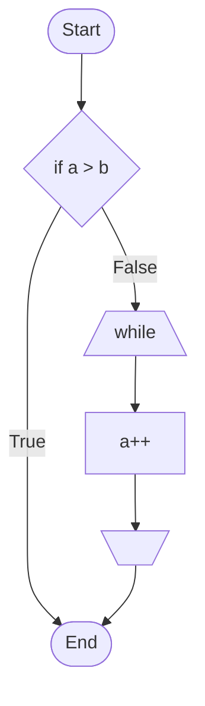
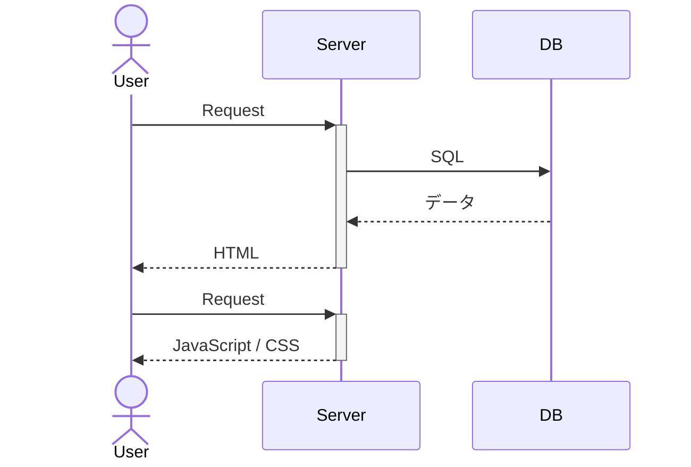
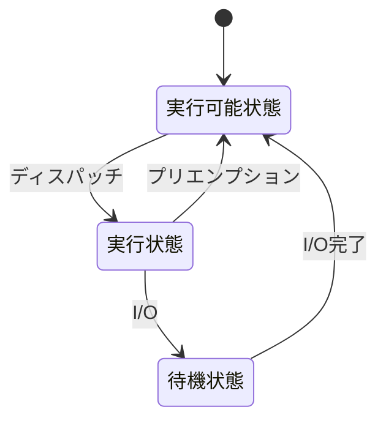
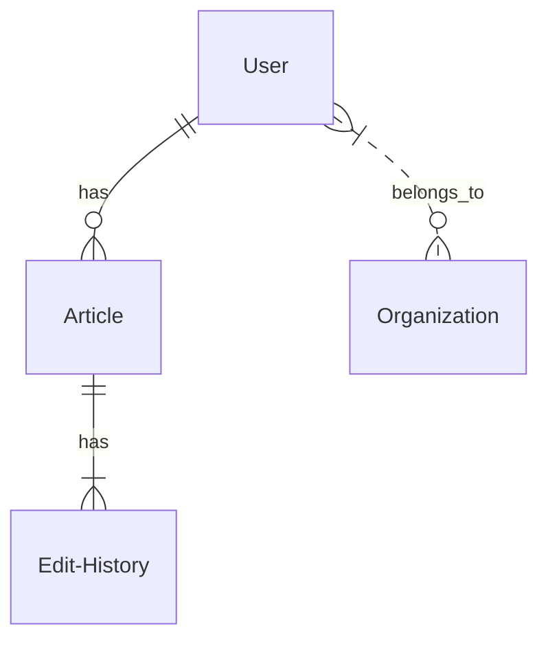
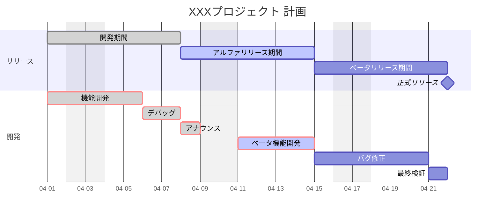
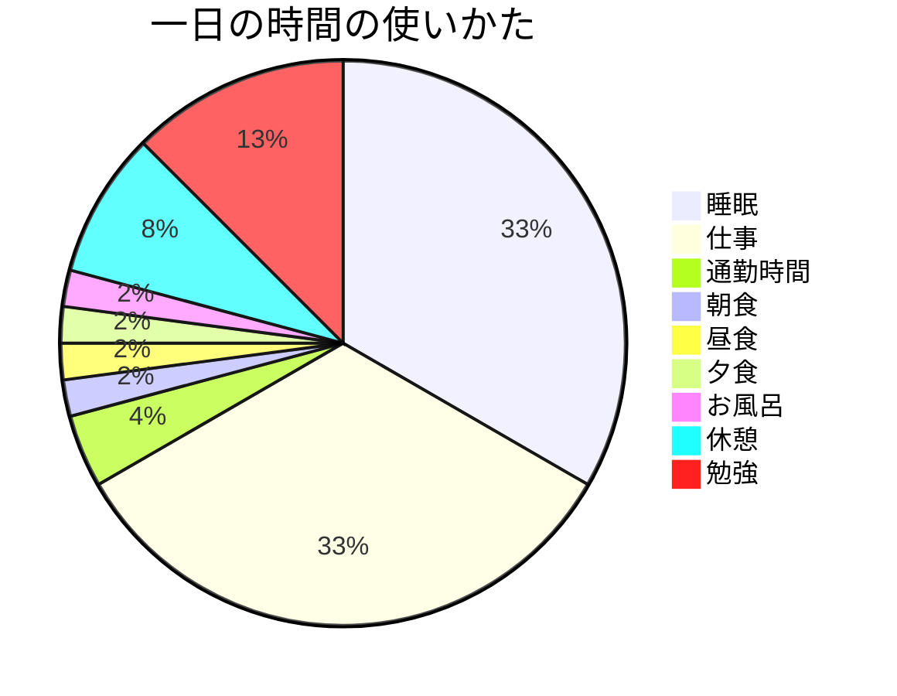
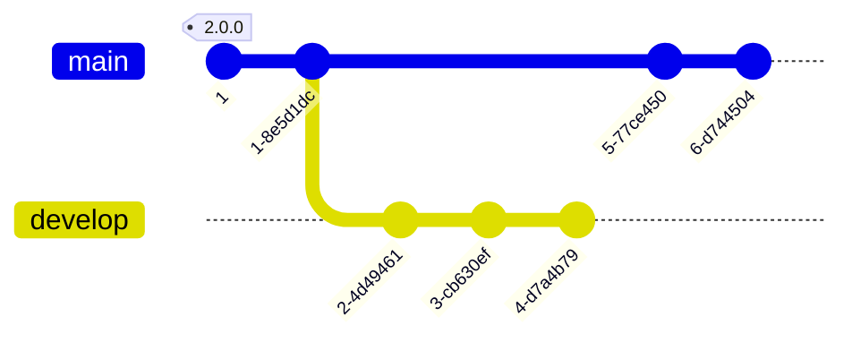
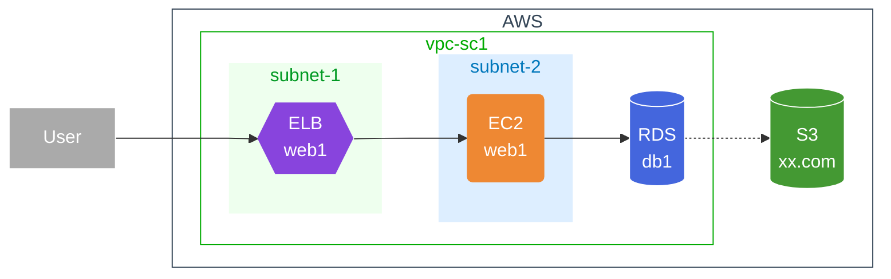

# test-mermaid

[VScode で OpenAPI を書くために便利なプラグイン一覧](https://zenn.dev/s_t_pool/articles/954dfe51b950c18d08e9)

## 使うメリット

どんな人が、どんな時に Mermaid を使うといいのか、Qiita で Mermaid を使うメリットをあげてみます。

1. テキストだけでなく、ダイアグラムも表現できるようになる
1. 見た目を凝って調整せずに、はじめから整ったきれいなダイアグラムが作れる
1. ダイアグラムの修正も簡単で、記事の編集履歴から差分も残すことができる
1. 別のダイアグラムをベースに、新たなダイアグラムを簡単に作ることができる

## ダイアグラム

## シーケンス図

## 状態遷移図

## ER 図

## ガントチャート

## 円グラフ

## Git グラフ

## AWS 構成図

## 参考

- [【Mermaid の紹介】Qiita でダイアグラム・チャートが簡単に書けるようになりました！ #Qiita - Qiita](https://qiita.com/Qiita/items/c07f3262d8f3b25f06c9)

- [スクラムの 3 つの作成物｜プロダクトバックログ、スプリントバックログ、インクリメントについて - SHIFT ASIA -ソフトウェア品質保証のプロフェッショナル-](https://shiftasia.com/ja/column/%E3%82%B9%E3%82%AF%E3%83%A9%E3%83%A0%E3%81%AE%EF%BC%93%E3%81%A4%E3%81%AE%E4%BD%9C%E6%88%90%E7%89%A9/)

- [テキストから図が生成できる Mermaid で AWS 構成図をつくる #AWS - Qiita](https://qiita.com/b-mente/items/b17275090176d63d1d69)
